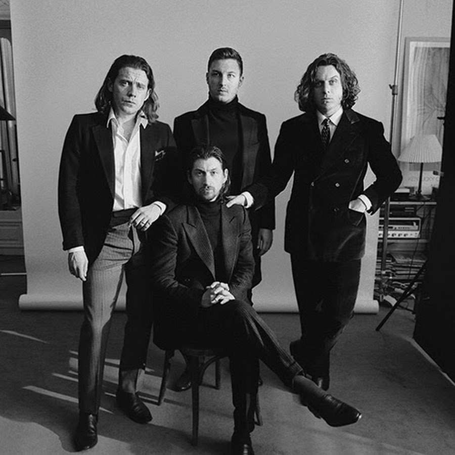

```{r, libaries}
library(spotifyr)
library(ggplot2)
library(plotly)
library(tidyverse)
library(usethis)
library(remotes)
library(flexdashboard)
library(compmus)
library(cowplot)
library(gridExtra)
library(tidymodels)
library(kknn)
library(heatmaply)
library(ggdendro)
library(tibble)
library(gtable)
library(egg)
library(grid)
library(cowplot)
library(magick)
library(gridGraphics)
library(ranger)
library(C50)
```

Introduction{.storyboard}
=========================================

### Plan

```{r}

```

***
Arctic Monkeys is a band that blew up during the garage rock revival of the early 2000s. The band skyrocketed due to their debut album: Whatever People Say I am, That's What I'm Not (WPSIATWIN). Because of the fast paced music, and Turner's cynical lyrics about nights out, it resonated with a lot of young people. As they got older they progressed to a more mature look on music. The fast paced almost punk-like tracks where they initially reached fame with dissipated.Josh Homme, the main cog in Queens of the Stone Age, helped them with this. He produced their third full length studio album: Humbug; a more sensitive and thoughtful album. After this the band never went back to the aggressive boyish music they made before. I am very curious in what way could be shown with Spotify's API that Josh Homme had a very big influence on the group. By comparing different eras of the band and drawing parallels between their albums and albums by Queens of the Stone Age I hope to give a clear view of their evolution. 
Many people point to this album as an important turning point for the band. 
[Article about Humbug by NME](https://www.nme.com/blogs/nme-blogs/arctic-monkeys-humbug-inside-story-divisive-album-2540411) 

On this page we can also see the discography of Arctic Monkeys. We'll only be looking at their full length studio albums and not every single/ep they have released. Queens of the Stone Age has been around longer than Arctic Monkeys. Due to this fact we'll only be using albums by them that were released after the birth of Arctic Monkeys.

### Method

```{r}
pic1 <- ggdraw() + draw_image("Whatever.jfif")
pic2 <- ggdraw() + draw_image("humbug.jfif")


plot_grid(pic1, pic2, nrow=2)

```


***
Firstly we will be taking a close look at Arctic Monkeys' albums. This way we can see if there is a clear distinction between their albums.
Here we will compare the albums in their discography on features such as a energy, valence, Their first full length studio album was released in 2006, their last studio album was released in 2019 so I am curious of what we are going to find. After having made these assessments we are going to take a look at, the relevant, Queens of the Stone Age's albums. THen we are going to compare the results and maybe we can find similarities that support my thesis. 

Figures {.storyboard}
=========================================

### Computer Classification of AM's albums

```{r, circs, echo=FALSE}
circshift <- function(v, n) {
  if (n == 0) v else c(tail(v, n), head(v, -n))
}

#      C     C#    D     Eb    E     F     F#    G     Ab    A     Bb    B
major_chord <-
  c(   1,    0,    0,    0,    1,    0,    0,    1,    0,    0,    0,    0)
minor_chord <-
  c(   1,    0,    0,    1,    0,    0,    0,    1,    0,    0,    0,    0)
seventh_chord <-
  c(   1,    0,    0,    0,    1,    0,    0,    1,    0,    0,    1,    0)

major_key <-
  c(6.35, 2.23, 3.48, 2.33, 4.38, 4.09, 2.52, 5.19, 2.39, 3.66, 2.29, 2.88)
minor_key <-
  c(6.33, 2.68, 3.52, 5.38, 2.60, 3.53, 2.54, 4.75, 3.98, 2.69, 3.34, 3.17)

chord_templates <-
  tribble(
    ~name, ~template,
    "Gb:7", circshift(seventh_chord, 6),
    "Gb:maj", circshift(major_chord, 6),
    "Bb:min", circshift(minor_chord, 10),
    "Db:maj", circshift(major_chord, 1),
    "F:min", circshift(minor_chord, 5),
    "Ab:7", circshift(seventh_chord, 8),
    "Ab:maj", circshift(major_chord, 8),
    "C:min", circshift(minor_chord, 0),
    "Eb:7", circshift(seventh_chord, 3),
    "Eb:maj", circshift(major_chord, 3),
    "G:min", circshift(minor_chord, 7),
    "Bb:7", circshift(seventh_chord, 10),
    "Bb:maj", circshift(major_chord, 10),
    "D:min", circshift(minor_chord, 2),
    "F:7", circshift(seventh_chord, 5),
    "F:maj", circshift(major_chord, 5),
    "A:min", circshift(minor_chord, 9),
    "C:7", circshift(seventh_chord, 0),
    "C:maj", circshift(major_chord, 0),
    "E:min", circshift(minor_chord, 4),
    "G:7", circshift(seventh_chord, 7),
    "G:maj", circshift(major_chord, 7),
    "B:min", circshift(minor_chord, 11),
    "D:7", circshift(seventh_chord, 2),
    "D:maj", circshift(major_chord, 2),
    "F#:min", circshift(minor_chord, 6),
    "A:7", circshift(seventh_chord, 9),
    "A:maj", circshift(major_chord, 9),
    "C#:min", circshift(minor_chord, 1),
    "E:7", circshift(seventh_chord, 4),
    "E:maj", circshift(major_chord, 4),
    "G#:min", circshift(minor_chord, 8),
    "B:7", circshift(seventh_chord, 11),
    "B:maj", circshift(major_chord, 11),
    "D#:min", circshift(minor_chord, 3)
  )

key_templates <-
  tribble(
    ~name, ~template,
    "Gb:maj", circshift(major_key, 6),
    "Bb:min", circshift(minor_key, 10),
    "Db:maj", circshift(major_key, 1),
    "F:min", circshift(minor_key, 5),
    "Ab:maj", circshift(major_key, 8),
    "C:min", circshift(minor_key, 0),
    "Eb:maj", circshift(major_key, 3),
    "G:min", circshift(minor_key, 7),
    "Bb:maj", circshift(major_key, 10),
    "D:min", circshift(minor_key, 2),
    "F:maj", circshift(major_key, 5),
    "A:min", circshift(minor_key, 9),
    "C:maj", circshift(major_key, 0),
    "E:min", circshift(minor_key, 4),
    "G:maj", circshift(major_key, 7),
    "B:min", circshift(minor_key, 11),
    "D:maj", circshift(major_key, 2),
    "F#:min", circshift(minor_key, 6),
    "A:maj", circshift(major_key, 9),
    "C#:min", circshift(minor_key, 1),
    "E:maj", circshift(major_key, 4),
    "G#:min", circshift(minor_key, 8),
    "B:maj", circshift(major_key, 11),
    "D#:min", circshift(minor_key, 3)
  )
```


```{r}
library(compmus)

get_conf_mat <- function(fit) {
  outcome <- .get_tune_outcome_names(fit)
  fit %>% 
    collect_predictions() %>% 
    conf_mat(truth = outcome, estimate = .pred_class)
}  

get_pr <- function(fit) {
  fit %>% 
    conf_mat_resampled() %>% 
    group_by(Prediction) %>% mutate(precision = Freq / sum(Freq)) %>% 
    group_by(Truth) %>% mutate(recall = Freq / sum(Freq)) %>% 
    ungroup() %>% filter(Prediction == Truth) %>% 
    select(class = Prediction, precision, recall)
}  

Humbug   <- 
  get_playlist_audio_features("Sidney Francis", "0z3uHF5QB4sJ8KcHQLDjKw")

Whatever <- get_playlist_audio_features("Sidney Francis", "20nBnqALo3mm3UehMXHvZq")

Tranquility <- get_playlist_audio_features("Sidney Francis", "1pMfrsZuzMuWBCGOKhdclb")

Favourite <- get_playlist_audio_features("Sidney Francis", "0lCqPpNJQ0jxXAP79aVQnY")

Suck <- get_playlist_audio_features("Sidney Francis", "1jAWFsfgHyvVbvK333ZP3w")

AM <- get_playlist_audio_features("Sidney Francis", "2KR2GEDrSiHi9JJmOG7oXz")

LC <- get_playlist_audio_features("Sidney Francis", "6NqNoBb1hWSUALKyk2UNtm")

EV <- get_playlist_audio_features("Sidney Francis", "119HL4eIPRFDwK09GBb33u" )

RR <- get_playlist_audio_features("Sidney Francis", "5suq29Tygf2xd45v9MdaRy")

Villains <- get_playlist_audio_features("Sidney Francis", "7j9RIuh0pxdmJ2cJeL6X1c")

Potion <- get_tidy_audio_analysis("3RHHXwyRtskFx87sX80xEy")

ALL_AM <-
  bind_rows(
      Humbug %>% mutate(album = "Humbug"),
    Whatever %>% mutate(album = "WPSIATWIN"),
    Tranquility %>% mutate(album = "TBHC"),
    Favourite %>% mutate(album = "FWN"), 
    Suck %>% mutate(album = "SIAS"),
    AM %>% mutate(album = "AM") 
    
  ) 

B4_jh <-
    bind_rows(
      Whatever %>% mutate(album = "WPSIATWIN"),
      Favourite %>% mutate(album = "FWN")
    )

After_jh <-
  bind_rows(
    Humbug %>% mutate(album = "Humbug"),
    Suck %>% mutate(album = "SIAS"),
    AM %>% mutate(album = "AM"),
    Tranquility %>% mutate(album= "TBHC")
  )

Only_AMb4 <- 
  bind_rows(
    Whatever %>% mutate(category = "AM Before"),
    Favourite %>% mutate(category = "AM Before")
  )

Only_AM_After <-
  bind_rows(
    Humbug %>% mutate(category = "AM After"),
    Suck %>% mutate(category = "AM After"),
    AM %>% mutate(category = "AM After"),
    Tranquility %>% mutate(category = "AM After")
  )

QOTSA_ALL <-
  bind_rows(
    LC %>% mutate(category = "QOTSA"),
    RR %>% mutate(category = "QOTSA"),
    EV %>% mutate(category = "QOTSA"),
    Villains %>% mutate(category = "QOTSA")
  )

AM_AND_QOTSA <- bind_rows (Only_AMb4, Only_AM_After, QOTSA_ALL)
```


```{r}
AM_Two <-
  bind_rows(
    Humbug %>% mutate(playlist = "Humbug"),
    Whatever %>% mutate(playlist = "WPSIATWIN"),
     ) 

  AM_features <-
  AM_Two %>%  # For your portfolio, change this to the name of your corpus.
  add_audio_analysis() %>% 
  mutate(
    playlist = factor(playlist),
    segments = map2(segments, key, compmus_c_transpose),
    pitches =
      map(
        segments,
        compmus_summarise, pitches,
        method = "mean", norm = "manhattan"
      ),
    timbre =
      map(
        segments,
        compmus_summarise, timbre,
        method = "mean",
      )
  ) %>%
  mutate(pitches = map(pitches, compmus_normalise, "clr")) %>%
  mutate_at(vars(pitches, timbre), map, bind_rows) %>%
  unnest(cols = c(pitches, timbre))

AM_recipe <-
  recipe(
    playlist ~
       instrumentalness +
    valence +
      duration,
    data = AM_features,          # Use the same name as the previous block.
  ) %>%
  step_center(all_predictors()) %>%
  step_scale(all_predictors())      # Converts to z-scores.
  # step_range(all_predictors())    # Sets range to [0, 1].

indie_cv <- AM_features %>% vfold_cv(5)

forest_model2 <-
  rand_forest() %>%
  set_mode("classification") %>% 
  set_engine("ranger", importance = "impurity")

Mat_Forest2 <- 
  workflow() %>% 
  add_recipe(AM_recipe) %>% 
  add_model(forest_model2) %>% 
  fit_resamples(
    indie_cv, 
    control = control_resamples(save_pred = TRUE)
  )

workflow() %>% 
  add_recipe(AM_recipe) %>% 
  add_model(forest_model2) %>% 
  fit(AM_features) %>% 
  pluck("fit", "fit", "fit") %>%
  ranger::importance() %>% 
  enframe() %>% 
  mutate(name = fct_reorder(name, value)) %>% 
  ggplot(aes(name, value)) + 
  geom_col() + 
  coord_flip() +
  theme_minimal() +
  labs(x = NULL, y = "Importance")

Mat_Forest2 %>% get_conf_mat() %>%
  autoplot(type = "heatmap")

Mat_Forest2 %>% get_pr()
```

***
Even though the computer does not classify everything perfectly, it is clear that there is something in WPSIATWIN that is distinctly different than TBHC or Humbug. WPSIATWIN lies the furthest from Josh Homme's interference chronologically (and in my opinion musically). In the heatmap it is clear that Humbug and THBHC have more in common than WPSIATWIN.

### Computer Classification AM & ...Like Clockwork
 
```{r}
AM_QOTSA <-
  bind_rows(
    Humbug %>% mutate(playlist = "Humbug"),
    LC %>% mutate(playlist = "...Like Clockwork"),
    
  ) 

  Qotsa_features <-
  AM_QOTSA %>%  # For your portfolio, change this to the name of your corpus.
  add_audio_analysis() %>% 
  mutate(
    playlist = factor(playlist),
    segments = map2(segments, key, compmus_c_transpose),
    pitches =
      map(
        segments,
        compmus_summarise, pitches,
        method = "mean", norm = "manhattan"
      ),
    timbre =
      map(
        segments,
        compmus_summarise, timbre,
        method = "mean",
      )
  ) %>%
  mutate(pitches = map(pitches, compmus_normalise, "clr")) %>%
  mutate_at(vars(pitches, timbre), map, bind_rows) %>%
  unnest(cols = c(pitches, timbre))

QOTSA_recipe <-
  recipe(
    playlist ~
danceability +
      energy +
      loudness +
      speechiness +
      acousticness +
      valence +
      tempo +
      duration,
    data = Qotsa_features,          # Use the same name as the previous block.
  ) %>%
  step_center(all_predictors()) %>%
  step_scale(all_predictors())      # Converts to z-scores.
  # step_range(all_predictors())    # Sets range to [0, 1].

AM_VS_QOTSA <- Qotsa_features %>% vfold_cv(5)

forest_model <-
  rand_forest() %>%
  set_mode("classification") %>% 
  set_engine("ranger", importance = "impurity")
Mat_Forest <- 
  workflow() %>% 
  add_recipe(QOTSA_recipe) %>% 
  add_model(forest_model) %>% 
  fit_resamples(
    AM_VS_QOTSA, 
    control = control_resamples(save_pred = TRUE)
  )

workflow() %>% 
  add_recipe(QOTSA_recipe) %>% 
  add_model(forest_model) %>% 
  fit(Qotsa_features) %>% 
  pluck("fit", "fit", "fit") %>%
  ranger::importance() %>% 
  enframe() %>% 
  mutate(name = fct_reorder(name, value)) %>% 
  ggplot(aes(name, value)) + 
  geom_col() + 
  coord_flip() +
  theme_minimal() +
  labs(x = NULL, y = "Importance")

Mat_Forest %>% get_conf_mat() %>%
  autoplot(type = "heatmap")

Mat_Forest %>% get_pr()
```


***
...Like Clockwork was the first album to be released by Queens of the Stone Age after Humbug, produced by Josh Homme. 
Josh Homme of course played on his own album with Queens of the Stage. 
Besides that, Alex Turner also appears on ...Like Clockwork. Here we see the computer classification of the both albums. The features used here. 


### Tempo AM


First we will be looking at the tempi of all songs for the Albums before Josh Homme's interference.
Both Whatever People Say I am, That's What I'm Not (WPSIATWIN) and Favourite Worst Nightmare (FWN), are from before Josh Homme got involved in the band's sounds.

 
#### Albums before Josh Homme interfered

```{r, tempo_histogram, echo=FALSE}

b4hist <- ggplot(data = B4_jh, mapping = aes(x = tempo)) + 
  geom_histogram(aes(fill = album)) +
  theme_light() +
  ggtitle("Tempos of albums before Josh Homme's interference") +
  theme()

ggplotly(b4hist)
```
None of the songs on these albums ever dropped below a BPM of 100. This is quite a high BPM. A lot of songs are also higher than 125 and some even higher than 150 and some even higher than that. The songs with the lowest BPM are between 100 and 110, and the most dense BPM is 136.


#### Albums after Josh Homme interfered

```{r}
Afterhist <- ggplot(data = ALL_AM, mapping = aes(x = tempo)) + 
  geom_histogram(aes(fill = album)) +
  theme_light() +
  xlab("Tempo BPM")
  ggtitle("Tempos after Josh Homme's interference") +
  theme()

ggplotly(Afterhist)
```
In this chart we see a lot more albums represented. What catches your eye is the amount of songs below 100 BPM. This supports the hypothesis of a more calm sense of self after Josh Homme interfered. The slowest songs are between 65 and 90, a lot slower than the slowest songs in the previous albums. The most dense BPM here is 131 also lower than the most dense BPM in the previous albums.
Even the quickest songs, they stand quite alone at the top, are not as quick as the quickest on their first two albums. If you hover over them it peaks at 178, while FWN an WPSIATWIN peak at 181 and 190 respectively.

### Tempo AM vs. QOTSA

```{r}
AMQOTSAHIST <- ggplot(data = AM_AND_QOTSA, mapping = aes(x = tempo)) + 
  geom_histogram(aes(fill = category)) +
  theme_light() +
  ggtitle("Tempos AM and QOTSA") +
  theme()

ggplotly(AMQOTSAHIST)
```

***
Here we have a visual representation of the tempi on every AM album and every QOTSA album since the founding of AM. 
If we look at the QOTSA albums you can see it is quite spread out along the graph. We can also see that the AM after category has the highest destiny on the same BPM that QOTSA has the highest density on. And as demonstrated earlier, we can see clearly that after Josh Homme's interference the band slowed down (there are still some outliers of course). 


### Tempograms

```{r}

Potion %>%
  tempogram(window_size = 8, hop_size = 1, cyclic = TRUE) %>%
  ggplot(aes(x = time, y = bpm, fill = power)) +
  geom_raster() +
  scale_fill_viridis_c(guide = "none") +
  labs(x = "Time (s)", y = "Tempo (BPM)") +
  theme_classic()

```


### Histograms of Energy


```{r, histos, echo=FALSE}
whatever_hist<- 
hist(Whatever$energy, main = "Energy on WPSIATWIN",
     xlab = "Energy Level",
     border="black", 
     col="purple", 
     xlim=c(0,1),
     ylim = c(0, 8),
     freq = FALSE)

Favourite_hist<-
  hist(Favourite$energy, main = "Energy on FWN",  xlab = "Energy Level",
       border="black", 
     col="purple", 
     xlim=c(0,1),
    ylim = c(0, 8),
     freq = FALSE)

Humbug_hist<-
   hist(Humbug$energy, main = "Energy on Humbug",  
     xlab = "Energy Level",
       border="black", 
     col="purple", 
     xlim=c(0, 1),
    ylim = c(0, 8),
     freq = FALSE)
     
Suck_hist<-
 hist(Suck$energy, main = "Energy on SIAS",  xlab = "Energy Level",
      border="black", 
     col="purple", 
     xlim=c(0, 1),
    
     ylim = c(0, 8),
     freq = FALSE)

AM_hist<- 
   hist(AM$energy, main = "Energy on AM",  xlab = "Energy Level",
        border="black", 
     col="purple", 
     xlim=c(0,1),
    
     ylim = c(0, 8),
     freq = FALSE)

Tranquility_hist<-
   hist(Tranquility$energy, main = "Energy on TBHC", xlab = "Energy Level",
        border="black", 
     col="purple", 
     xlim=c(0,1),
    
     ylim = c(0, 8),
     freq = FALSE,)


```


***
Here we have a clear view of the frequency of every energy level on every full length album the band has produced. What is interesting to me is that their latest album, Tranquility Base Hotel & Casino (TBHC), had the highest density on the higher energy level. I expected WPSIATWIN to have the highest energy level due to the high energy garage rock sound. It is clear that even though the energy is high on TBHC the tempi of most songs are quite a bit lower than on WPSIATWIN. This is the distinction between boyish aggression and their more mature music from today. 


### Chordogram/Keygram


***
These are the Keygram and Chordogram from one of the outliers. I haven't had the chance to compare these to other songs from my Corpus.


### Chroma/Cepstrograms


I'm Still Standing - Elton John
Self similarities


### Graphs/Visuals


```{r, allplots}
  all_plots <-
  ALL_AM %>%  
  ggplot(                          # Set up the plot.
    aes(
      x = energy,
      y = danceability,
      colour = mode,
      size = track.popularity,
      label = track.name           # Labels will be interactively visible.
    )
  ) +
  geom_point(shape = ".") +                   # Scatter plot.
  geom_rug(size = 0.1) +           # Add 'fringes' to show data distribution.
  facet_wrap(~album) +           # Separate charts per country.
  scale_x_continuous(              # Fine-tune the x axis.
    limits = c(0, 1),
    breaks = c(0, 0.50, 1),        # Use grid-lines for quadrants only.
    minor_breaks = NULL            # Remove 'minor' grid-lines.
  ) +
  scale_y_continuous(              # Fine-tune the y axis in the same way.
    limits = c(0.5, 1),
    breaks = c(0, 0.50, 1),
    minor_breaks = NULL
  ) +
  scale_colour_viridis_c(          # Use the cividis palette
    option = "C",                  # Qualitative set.
    alpha = 0.8,                   # Include some transparency
    guide = "none"
  ) +
  scale_size_continuous(           # Fine-tune the sizes of each point.
    guide = "none"                # Remove the legend for size.
  ) +
  theme_classic() +                  # Use a simpler theme.
  labs(                            # Make the titles nice.
    x = "Energy",
    y = "Danceability"
  )
ggplotly(all_plots)
```


```{r setup, include=FALSE}
knitr::opts_chunk$set(echo = FALSE)

                  
```

```{r, cache = TRUE}

Dancefloor <-
I_bet %>%
  tempogram(window_size = 8, hop_size = 1, cyclic = TRUE) %>%
  ggplot(aes(x = time, y = bpm, fill = power)) +
  geom_raster() +
  scale_fill_viridis_c(guide = "none") +
  labs(x = "Time (s)", y = "Tempo (BPM)") +
  theme_classic()

Lightning <-
Crying %>%
  tempogram(window_size = 8, hop_size = 1, cyclic = TRUE) %>%
  ggplot(aes(x = time, y = bpm, fill = power)) +
  geom_raster() +
  scale_fill_viridis_c(guide = "none") +
  labs(x = "Time (s)", y = "Tempo (BPM)") +
  theme_classic()

grid.arrange(Dancefloor, Lightning)

```


```{r}
library(compmus)

get_conf_mat <- function(fit) {
  outcome <- .get_tune_outcome_names(fit)
  fit %>% 
    collect_predictions() %>% 
    conf_mat(truth = outcome, estimate = .pred_class)
}  

get_pr <- function(fit) {
  fit %>% 
    conf_mat_resampled() %>% 
    group_by(Prediction) %>% mutate(precision = Freq / sum(Freq)) %>% 
    group_by(Truth) %>% mutate(recall = Freq / sum(Freq)) %>% 
    ungroup() %>% filter(Prediction == Truth) %>% 
    select(class = Prediction, precision, recall)
}  
```


```{r}


  AM_features <-
  AM_Two %>%  # For your portfolio, change this to the name of your corpus.
  add_audio_analysis() %>% 
  mutate(
    playlist = factor(playlist),
    segments = map2(segments, key, compmus_c_transpose),
    pitches =
      map(
        segments,
        compmus_summarise, pitches,
        method = "mean", norm = "manhattan"
      ),
    timbre =
      map(
        segments,
        compmus_summarise, timbre,
        method = "mean",
      )
  ) %>%
  mutate(pitches = map(pitches, compmus_normalise, "clr")) %>%
  mutate_at(vars(pitches, timbre), map, bind_rows) %>%
  unnest(cols = c(pitches, timbre))

AM_recipe <-
  recipe(
     playlist ~
      danceability +
      energy +
      loudness +
      speechiness +
      acousticness +
      instrumentalness +
      liveness +
      valence +
      tempo +
      duration +
      C + `C#|Db` + D + `D#|Eb` +
      E + `F` + `F#|Gb` + G +
      `G#|Ab` + A + `A#|Bb` + B +
      c01 + c02 + c03 + c04 + c05 + c06 +
      c07 + c08 + c09 + c10 + c11 + c12,  
     data = AM_features # Use the same name as the previous block.
  ) %>%
  step_center(all_predictors()) %>%
  step_scale(all_predictors())      # Converts to z-scores.
  # step_range(all_predictors())    # Sets range to [0, 1].


indie_cv <- AM_features %>% vfold_cv(5)

forest_model2 <-
  rand_forest() %>%
  set_mode("classification") %>% 
  set_engine("ranger", importance = "impurity")

Mat_Forest2 <- 
  workflow() %>% 
  add_recipe(AM_recipe) %>% 
  add_model(forest_model2) %>% 
  fit_resamples(
    indie_cv, 
    control = control_resamples(save_pred = TRUE)
  )

importante <-
workflow() %>% 
  add_recipe(AM_recipe) %>% 
  add_model(forest_model2) %>% 
  fit(AM_features) %>% 
  pluck("fit", "fit", "fit") %>%
  ranger::importance() %>% 
  enframe() %>% 
  mutate(name = fct_reorder(name, value)) %>% 
  ggplot(aes(name, value)) + 
  geom_col() + 
  coord_flip() +
  theme_minimal() +
  labs(x = NULL, y = "Importance")

Killem <-
Mat_Forest2 %>% get_conf_mat() %>%
  autoplot(type = "heatmap")


Killem
importante


```