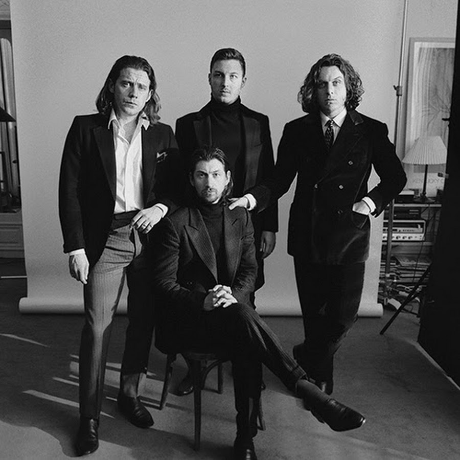

```{r, libaries}
library(spotifyr)
library(ggplot2)
library(plotly)
library(tidyverse)
library(usethis)
library(remotes)
library(flexdashboard)
library(compmus)
library(cowplot)
library(gridExtra)
library(tidymodels)
library(kknn)
library(heatmaply)
library(ggdendro)
library(tibble)
library(gtable)
library(egg)
library(grid)
library(cowplot)
library(magick)
library(gridGraphics)
library(ranger)
library(C50)
library(png)
library(dplyr)
```

<style>

    .sbframe-commentary {
    width: 21vw;
    min-width: 350px;
}

</style>

Introduction{.storyboard}
=========================================

### Welcome Threatening Stir

```{r}

```

***
Arctic Monkeys is a band that blew up during the garage rock revival of the early 2000s. The band skyrocketed due to their debut album: Whatever People Say I am, That's What I'm Not (WPSIATWIN). Because of the fast paced music, and Turner's cynical lyrics about nights out, it resonated with a lot of young people. As they got older they progressed to a more mature look on music. The fast paced almost punk-like tracks where they initially reached fame with dissipated. Josh Homme, the main cog in Queens of the Stone Age, helped them with this. He produced their third full length studio album: Humbug; a more sensitive and thoughtful album. After this the band never went back to the aggressive boyish music they made before. I am very curious to what extent these albums differ using the Spotify API. By comparing different features of the two albums I hope to find interesting data. 

Many people point to this album as an important turning point for the band, but this is only by ear and opinion. I am interested in seeing how Spotify's API can support this.

[Article about Humbug by NME](https://www.nme.com/blogs/nme-blogs/arctic-monkeys-humbug-inside-story-divisive-album-2540411) 

[Article about Humbug by Spectrum Culture](https://spectrumculture.com/2019/03/04/revisit-arctic-monkeys-humbug/)

[Article about Humbug by Brooklyn Vegan](https://www.brooklynvegan.com/arctic-monkeys-humbug-turns-10-a-look-back-on-the-bands-most-pivotal-album/)

### Corpus

```{r}
pic1 <- ggdraw() + draw_image("Whatever.jpg")
pic2 <- ggdraw() + draw_image("humbug.jpg")


plot_grid(pic1, pic2, nrow=1)

```

***
These are the two albums in question (WPSIATWIN, Humbug). 

WPSIATWIN is their first album and was recorded in  Sheffield, England in 2006. Their hometown. The band members, who are childhood friends, were no older than twenty and the music they made represented that. The loud guitars scream adolescence with an energy that only young people can have. The songs are about going out and being young. Multiple tracks describe events during a Friday night that some might find a little too familiar. From waiting for a girl to notice you in a bar without actually doing something noticeable, to getting beat up by policemen and being thrown into their van. The lyrics describe Alex Turner's view on the world around him in a cheecky yet witty way. Their 'we don't care we just play music' attitude only helped their rise to fame. 

Humbug was a different moment in the band's musical career and  their individual lives. They had reached the top in the blink of an eye, mostly to the (then new) phenomenon of file sharing. In the meantime they had released their second album Favourite Worst Nightmare which, even though different in certain ways, seemed like an extension of their first album. Then came Humbug. The band teamed up with Queens of the Stone Age front man, Josh Homme. Homme produced the entire album. He lured them away from their safe haven in England and brought them to the sunny California in 2009. Here, like many before them, they were influenced by the vast desserts California has to offer. Both their teaming up with Homme, and change of scenery seemed to have shaped the band in a way they would never return from. What came forth out of this is a melancholic desert rock album that is incredibly different than their previous works. Homme introduced the band to a new way of making music. Arctic Monkeys sound more mature on these tracks. The main goal does not appear to be to energize anymore. The lyrics had moved past the teenage experiences and leaned more into ambiguous hints at long lost loves. The vocals went from quick and high to a more slow tempo. Turner started to experiment with his voice, exploring his lower ranges. After this the band never went back to their youthful ways. They went on to produce three more studio albums which in their turn would differ from these ones too, but not as drastically as Humbug once did.

[Whatever People Say I Am, That's What I'm Not](https://open.spotify.com/album/50Zz8CkIhATKUlQMbHO3k1?si=4EgT1jE6Sga4QHXVTbUkyw)

[Humbug](https://open.spotify.com/album/5IEoiwkThhRmSMBANhpxl2?si=GzZEOBV_RE-7lMp6rYPIZg)

The Albums {.storyboard}
=========================================

```{r, corpus}
Humbug   <- 
  get_playlist_audio_features("Sidney Francis", "0z3uHF5QB4sJ8KcHQLDjKw")

Whatever <- get_playlist_audio_features("Sidney Francis", "20nBnqALo3mm3UehMXHvZq")

I_bet <- get_tidy_audio_analysis("3DQVgcqaP3iSMbaKsd57l5")

Crying <- get_tidy_audio_analysis("6wVWJl64yoTzU27EI8ep20")

Jeweller <- get_tidy_audio_analysis("4PDPn7HosIycoXeoeibFc5")

Romance <- get_tidy_audio_analysis("0eDQj41kzBhMKQIkTt6OJR")

AM_Two <-
  bind_rows(
    Humbug %>% mutate(playlist = "Humbug"),
    Whatever %>% mutate(playlist = "WPSIATWIN"),
     ) 
```


### Scatter plots

```{r, allplots}
  all_plots <-
  AM_Two %>%  
  ggplot(                          # Set up the plot.
    aes(
      x = energy,
      y = valence,
      colour = mode,
      size = tempo,
      label = track.name           # Labels will be interactively visible.
    )
  ) +
  geom_point(shape = ".") +                   # Scatter plot.
  geom_rug(size = 0.1) +           # Add 'fringes' to show data distribution.
  facet_wrap(~playlist) +           # Separate charts per country.
  scale_x_continuous(              # Fine-tune the x axis.
    limits = c(0, 1),
    breaks = c(0, 0.50, 1),        # Use grid-lines for quadrants only.
    minor_breaks = NULL            # Remove 'minor' grid-lines.
  ) +
  scale_y_continuous(              # Fine-tune the y axis in the same way.
    limits = c(0., 1),
    breaks = c(0, 0.50, 1),
    minor_breaks = NULL
  ) +
  scale_colour_viridis_c(          # Use the cividis palette
    option = "C",                  # Qualitative set.
    alpha = 0.8,                   # Include some transparency
    guide = "none"
  ) +
  scale_size_continuous(           # Fine-tune the sizes of each point.
    guide = "none"                # Remove the legend for size.
  ) +
  theme_dark() +                  # Use a simpler theme.
  labs(                            # Make the titles nice.
    x = "energy",
    y = "Valence"
  )

ggplotly(all_plots)
```

***
These scatter plots show us the values of the individual tracks for certain features from Spotify's API. **X-axis: Energy, Y-axis: Valence** On the x-axis we have the feature energy. I found this feature particularly important for this corpus. What is clear is that even though some of the tracks on WPSIATWIN are quite low in energy, the majority is very high. On Humbug the energy is still there but noticeably lower than on WPSIATWIN. On the y-axis we have valence, a feature that I thought would have been defined. The valence on Humbug seems to be a little more centered than on WPSIATWIN. In that scatter plot we see dots all over the place. The valence on Humbug tops at 0.7. The valence on WPSIATWIN tops off at 0.9 with three other songs higher than the highest valence on Humbug. 

Tempo is also interesting. It is represented in the sizes of the dots. You can see that a lot of the tracks on WPSIATWIN have a, albeit slightly, higher value than Humbug. The mode is represented in the colour of the dots (yellow being major and blue minor). We can see that a larger percentage on WPSIATWIN is in a major scale than on Humbug 

### Get in line!

```{r, circs, echo=FALSE}
circshift <- function(v, n) {
  if (n == 0) v else c(tail(v, n), head(v, -n))
}

#      C     C#    D     Eb    E     F     F#    G     Ab    A     Bb    B
major_chord <-
  c(   1,    0,    0,    0,    1,    0,    0,    1,    0,    0,    0,    0)
minor_chord <-
  c(   1,    0,    0,    1,    0,    0,    0,    1,    0,    0,    0,    0)
seventh_chord <-
  c(   1,    0,    0,    0,    1,    0,    0,    1,    0,    0,    1,    0)

major_key <-
  c(6.35, 2.23, 3.48, 2.33, 4.38, 4.09, 2.52, 5.19, 2.39, 3.66, 2.29, 2.88)
minor_key <-
  c(6.33, 2.68, 3.52, 5.38, 2.60, 3.53, 2.54, 4.75, 3.98, 2.69, 3.34, 3.17)

chord_templates <-
  tribble(
    ~name, ~template,
    "Gb:7", circshift(seventh_chord, 6),
    "Gb:maj", circshift(major_chord, 6),
    "Bb:min", circshift(minor_chord, 10),
    "Db:maj", circshift(major_chord, 1),
    "F:min", circshift(minor_chord, 5),
    "Ab:7", circshift(seventh_chord, 8),
    "Ab:maj", circshift(major_chord, 8),
    "C:min", circshift(minor_chord, 0),
    "Eb:7", circshift(seventh_chord, 3),
    "Eb:maj", circshift(major_chord, 3),
    "G:min", circshift(minor_chord, 7),
    "Bb:7", circshift(seventh_chord, 10),
    "Bb:maj", circshift(major_chord, 10),
    "D:min", circshift(minor_chord, 2),
    "F:7", circshift(seventh_chord, 5),
    "F:maj", circshift(major_chord, 5),
    "A:min", circshift(minor_chord, 9),
    "C:7", circshift(seventh_chord, 0),
    "C:maj", circshift(major_chord, 0),
    "E:min", circshift(minor_chord, 4),
    "G:7", circshift(seventh_chord, 7),
    "G:maj", circshift(major_chord, 7),
    "B:min", circshift(minor_chord, 11),
    "D:7", circshift(seventh_chord, 2),
    "D:maj", circshift(major_chord, 2),
    "F#:min", circshift(minor_chord, 6),
    "A:7", circshift(seventh_chord, 9),
    "A:maj", circshift(major_chord, 9),
    "C#:min", circshift(minor_chord, 1),
    "E:7", circshift(seventh_chord, 4),
    "E:maj", circshift(major_chord, 4),
    "G#:min", circshift(minor_chord, 8),
    "B:7", circshift(seventh_chord, 11),
    "B:maj", circshift(major_chord, 11),
    "D#:min", circshift(minor_chord, 3)
  )

key_templates <-
  tribble(
    ~name, ~template,
    "Gb:maj", circshift(major_key, 6),
    "Bb:min", circshift(minor_key, 10),
    "Db:maj", circshift(major_key, 1),
    "F:min", circshift(minor_key, 5),
    "Ab:maj", circshift(major_key, 8),
    "C:min", circshift(minor_key, 0),
    "Eb:maj", circshift(major_key, 3),
    "G:min", circshift(minor_key, 7),
    "Bb:maj", circshift(major_key, 10),
    "D:min", circshift(minor_key, 2),
    "F:maj", circshift(major_key, 5),
    "A:min", circshift(minor_key, 9),
    "C:maj", circshift(major_key, 0),
    "E:min", circshift(minor_key, 4),
    "G:maj", circshift(major_key, 7),
    "B:min", circshift(minor_key, 11),
    "D:maj", circshift(major_key, 2),
    "F#:min", circshift(minor_key, 6),
    "A:maj", circshift(major_key, 9),
    "C#:min", circshift(minor_key, 1),
    "E:maj", circshift(major_key, 4),
    "G#:min", circshift(minor_key, 8),
    "B:maj", circshift(major_key, 11),
    "D#:min", circshift(minor_key, 3)
  )
```

```{r}
picmatrix <- ggdraw() + draw_image("matrix.png")
picimportance <- ggdraw() + draw_image("importance.png")
picafterpred <- ggdraw() + draw_image("afterpred.png")

plot_grid(picmatrix, picimportance, picafterpred, nrow=2)


```


***
The computer has made a classification of all the songs on both albums. It used a random forest model. The reason I decided to use this method rather than the K-nearest neigbour model or  the decision tree model is because the computer seemed to perform better in classifying the tracks to their albums using the random forest model. It predicts on which album the song is found based on certain features I picked out. 

The features used in this particular matrix are instrumentalness, valence and the second timbre component (brightness). The second timbre component is very important in this classification. Something I expected previously, due to the dark undertones of the desert rock driven Humbug. I expected the valence feature to be a lot more important. In my perception WPSIATWIN is a more cheerful album, where the vocals skip on quick guitar riffs mostly in the major mode. Humbug has always been more melancholic in my ears, with near dreary organs and slower drum rhythms. So I assumed that valence would have played a bigger role. 

The instrumentalness also seems to be important for classifying these two albums. I think this is the difference in maturity between the albums. Where WPSIATWIN is a very straight forward album where loudness sometimes seems to be more important than instrumentalness. On Humbug the songs fluctuate more between different moods. They experimented more with the sounds they can get out of their instrument. The melodical lines seem to be more thought through than before.

Individual Songs {.storyboard}
=========================================

### The Tracks
The two songs that we are going to dive into are A Certain Romance from the album WPSIATWIN and The Jeweller's Hands from the album Humbug. Incidentally they are both the final tracks on their own albums.

Here is A Certain Romance, with a loudness of -5.587 DB
and a tempo of 137.949 BPM it is significantly louder and faster paced than The Jeweller's Hands (loudness: -8.116 DB, tempo 96.935 BPM) which are good representations for the albums. They are good representations for the albums because they are both the last track on their respective albums. This means that the band made a conscious artistic decision to send listeners away with the feelings they get from these songs, therefore they are good representations. 

#### Listen here


<iframe src="https://open.spotify.com/embed/track/0eDQj41kzBhMKQIkTt6OJR" width="300" height="380" frameborder="0" allowtransparency="true" allow="encrypted-media"></iframe>


Here is The Jeweller's Hands
<iframe src="https://open.spotify.com/embed/track/4PDPn7HosIycoXeoeibFc5" width="300" height="380" frameborder="0" allowtransparency="true" allow="encrypted-media"></iframe>


### Tempograms

```{r}

knitr::include_graphics("tempogram.png")
```

***
Here we have tempograms of two songs. The tempogram at the top is from Arctic Monkey's biggest hit song on the album WPSIATWIN: I Bet You Look Good On The Dancefloor. The tempogram on the bottom is from their biggest hit on the album Humbug: Crying Lightning. Spotify's API has tried its best to make a good tempogram, but because of the silences on Crying Lightning (which you can see around the 160 second mark) the tempogramm shows different BPM values at those point. These silences are barely found on their first album on which every song seems to be written with the purpose to constantly fill your ears with pulsating instruments. Near the end the drums switch patterns and start to accentuate every eigth note. This is why the tempogram shows multiple BPM values at the end as well. 

On the first album the pulse is very steady on nearly every track, like you would expect on an indie garage rock album. This is also very well displayed in the first tempogram. The yellow line is very clear and barely wavers, because the audio does not cut off cleanly at the end of the track we can see the same display of yellow areas as we can see in the one on the bottom. 

### Histograms of Loudness

```{r}
histloudness_hum <- AM_Two   %>%
  ggplot(aes( x = energy)) +
   geom_histogram(aes( y=..density..),      # Histogram with density instead of count on y-axis
                   colour="black", fill="#b8627dff") +
    geom_density( alpha=.5, fill="#403891ff")  + # Overlay with transparent density plot
  facet_wrap(~playlist) +
   labs(x = "Loudness (DB)", y = "Density") +
  theme_classic()


ggplotly(histloudness_hum)
```


***
Here we have a clear view of the density of loudness on both albums. I assumed WPSIATWIN was going to be louder. Which it appears to be. If we look at the mean in both graphs, we see that it peaks higher on WPSIATWIN, around 0.9 with a density of 5.9. Humbug's mean peaks around 0.8 with a density of 2.6. This also shows the boyish aggression that I assiociate the first album with. 


### Chromograms

```{r}
chromo1<-
  Jeweller %>%
  select(segments) %>%
  unnest(segments) %>%
  select(start, duration, pitches)

plot1 <-
chromo1 %>%
  mutate(pitches = map(pitches, compmus_normalise, "euclidean")) %>%  
  compmus_gather_chroma() %>% 
  ggplot(
    aes(
      x = start + duration / 2,
      width = duration,
      y = pitch_class,
      fill = value
    )
  ) +
  ggtitle("The Jeweller's Hands") +
  geom_tile() +
  labs(x = "Time (s)", y = NULL, fill = "Magnitude") +
  theme_minimal() +
  scale_fill_viridis_c()

chromo2<-
  Romance %>%
  select(segments) %>%
  unnest(segments) %>%
  select(start, duration, pitches)

plot2 <-
chromo2 %>%
  mutate(pitches = map(pitches, compmus_normalise, "euclidean")) %>%  
  compmus_gather_chroma() %>% 
  ggplot(
    aes(
      x = start + duration / 2,
      width = duration,
      y = pitch_class,
      fill = value
    )
  ) +
  ggtitle("A Certain Romance") +
  geom_tile() +
  labs(x = "Time (s)", y = NULL, fill = "Magnitude") +
  theme_minimal() +
  scale_fill_viridis_c()


grid.arrange(plot1, plot2)
```


***
These are the chordograms of two songs I find representative for each albums. The one at the top is of the song The Jewller's Hands from Humbug. This song is quite musical and displays the melancholic tones of the album clearly. The key in which it is in is C-minor. The tonic is clearly some form of C given the magnitude in this row. E is not played at all and E-flat is. From here on we can assume that it is C-minor. The fifth is also played a lot, the G. At every single second in the song there is a lot of different instruments playing at a different pitch. The songs harmonies are thought out well. The seventh is used a lot as a segway back to the tonic. This displays a form of musicality that shows maturity. The minor mode also has a certain sense of realism to a discography that always sounded more positive than negative. 

The chordorgram at the bottom is from a song called A Certain Romance, a track on WPSIATWIN it is very punk-like and the harmonies are quite easy and not as well thought out as on Humubg. You van see again that the tonic (B) is used often in the song exchanging itself for E. But on this track not a lot of other pitches can be heard during these seconds. Around the fifty second mark the song starts to switch between B and E without anything else happening. This also happens at the end which is clearly visible in the chordogram. During the middel part of the song the keys switch rapidly, but it seems repetitive in this chordogram. Not a lot of interesting harmonies can be found. The major mode it is in (B-major) also displays this form of a more adoscelent group of artists.


Conclusion {.storyboard}
=========================================


```{r}
ggdraw() + draw_image("discog.jpg")

```

***
On this page I have clearly demonstrated the greatest differences between the albums. The features that made them sound so differently have been put under a magnifying glass. What I had previously suspected turned out to be partially true. I thought this conclusion would be a lot more definitive then it turns out to be. The aggressive boyish music they used the make is clearly displayed in the graphs, but I hoped that the **valence** would be more decisive. I hoped that the melancholy of Humbug would be better displayed under this feature. **The second timbre component** did show a large difference between the albums. With WPSIATWIN scoring higher than Humbug on this feature, thus emphasizing the melancholy of Humbug a little. Overall I really enjoyed making a visual display of songs I have been listening to for a long time. A lot of magazines have described the differences they found the most prominent, but this page visually shows in what way they actually differ. I think the way that this album has been desribed as a pivotal point for the band really splits the bands' music up in multiple eras, but I enjoy them equally.


```{r setup, include=FALSE}
knitr::opts_chunk$set(echo = FALSE)

                  
```

